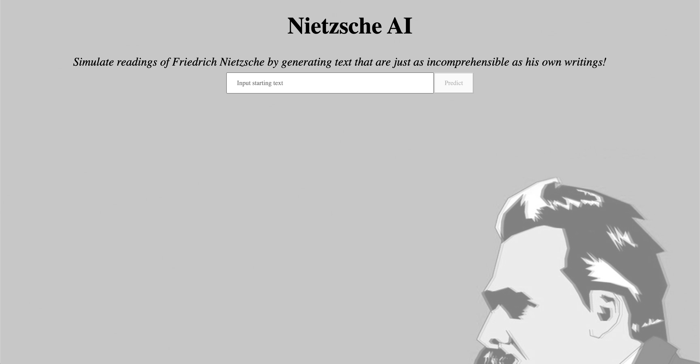

# Nietzsche AI

Created a recurrent neural network that takes in the writings of Friedrich
Nietzsche and auto-completes text based on user input. The model is deployed on
Flask and form input is gathered from React.

The model is able to generate text from input in ~3secs using uncompressed
model. It works much better on localhost.

Improvements:

- RNN model could be trained on more data to create more cohorent sentences

Constraints:

- RAM usage of model exceeds Heroku allocation after a few text generations
- Heroku cold starts prevent generation for ~15secs after 30mins of inactivity

